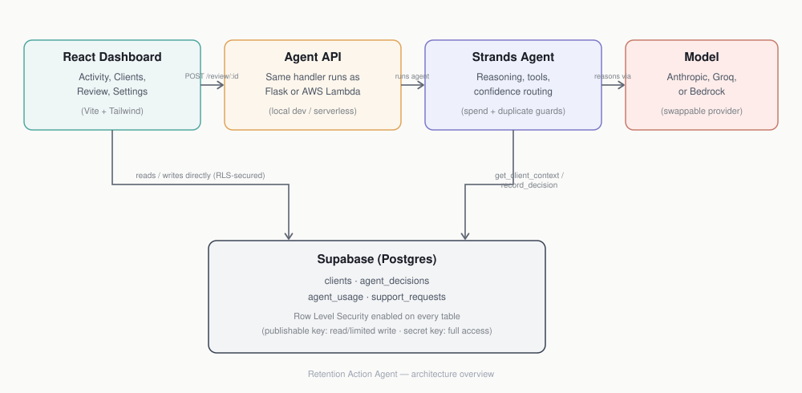

# Retention Action Agent

An autonomous agent that helps freelance consultants and small service
businesses keep clients from quietly churning — built for AWS's
**Agents for Humans Hackathon** (Professional Agents track) using the
**Strands Agents SDK**.

Most churn-detection tools stop at a dashboard: they tell you a client
is at risk and leave the rest to you. This one doesn't stop there. It
reviews the client's situation, decides whether action is warranted,
drafts that action itself, and either sends it or flags it for a quick
human decision — depending on how confident it is.


 ## Architecture




## The problem

Freelance consultants and small agencies lose clients not because they
don't care, but because follow-up is easy to let slip when you're
running the business solo. By the time a churn-risk dashboard gets
checked, the moment to act has often passed.

## Who it's for

Freelancers, consultants, and small service businesses managing a
client book largely on their own.

## How it works

1. **Trigger** — the agent is asked to review a specific client (a
   scheduled run, once deployed, replaces manual triggering).
2. **Gather context** — a tool (`get_client_context`) pulls the
   client's risk score, days since last contact, and recent notes from
   Supabase.
3. **Reason** — the model reads that context and decides *whether*
   action is warranted and *what kind* (a check-in message, a call, or
   nothing).
4. **Draft** — if action is warranted, the model drafts it in the
   consultant's voice.
5. **Decide and record** — the model calls `record_decision` with its
   proposed action and an honest confidence score.
6. **Route** — this step is deliberately *not* left to the model. Plain
   code checks the confidence score against a threshold (0.75 by
   default). Above it, the action is marked auto-sent. Below it, it's
   flagged for human review. A human is always in the loop for
   anything ambiguous.

```
Client data (Supabase)
        │
        ▼
  Strands agent ── reasons, calls tools, decides
        │
        ├── confidence ≥ 0.75 ──▶ Sends message automatically
        │
        └── confidence < 0.75 ──▶ Flags for human review
                        │
                        ▼
                    Dashboard
        (activity log, review inbox, settings)
```

## Tech stack

- **Agent core**: Python, [Strands Agents SDK](https://strandsagents.com)
- **Model**: swappable — built to run on Anthropic's API, AWS Bedrock,
  or Groq's free tier with a one-line change to `build_agent()`, since
  Strands supports all three as model providers
- **Database**: Supabase (Postgres), with Row Level Security enabled
  on all tables
- **Dashboard**: React, Vite, Tailwind CSS
- **Deployment target**: AWS Lambda, with Amazon Bedrock AgentCore as
  an optional upgrade path

## Project structure

```
retention-agent/
├── agent/
│   └── retention_agent.py   # agent core: tools, reasoning loop, safeguards
├── requirements.txt
├── .env.example
├── LICENSE
└── README.md

retention-dashboard/
├── src/
│   ├── pages/                # Activity, Review inbox, Settings, Support, Privacy
│   ├── components/           # Sidebar, DecisionCard, ConfidenceGauge, ThemeSwitcher
│   └── lib/                  # Supabase client, caching layer
└── ...
```

## Safeguards built in

- **Row Level Security** on every Supabase table — the dashboard's
  public key can only do what it's explicitly allowed to
- **Daily call cap** to protect API spend from runaway usage
- **Duplicate-decision guard** so the same client isn't re-reviewed
  (and re-billed) within a 12-hour window
- **Fail-fast config checks** — missing environment variables stop the
  program immediately with a clear message, rather than failing deep
  in a library

## Setup

### Agent

```bash
git clone <this-repo-url>
cd retention-agent
python -m venv venv
venv\Scripts\activate        # Windows
# source venv/bin/activate   # macOS/Linux
pip install -r requirements.txt
```

Copy `.env.example` to `.env` and fill in:
```
ANTHROPIC_API_KEY=...   # or GROQ_API_KEY, depending on model provider
SUPABASE_URL=...
SUPABASE_KEY=...        # secret key, not the publishable one — this runs server-side
```

Create the required tables in your Supabase project's SQL Editor:
```sql
create table clients (
  id uuid primary key default gen_random_uuid(),
  name text not null,
  risk_score float not null default 0,
  last_contact_days_ago int not null default 0,
  recent_notes text,
  payment_status text default 'current',
  created_at timestamptz default now()
);

create table agent_decisions (
  id uuid primary key default gen_random_uuid(),
  client_id uuid references clients(id),
  action text not null,
  message_draft text,
  confidence float not null,
  reasoning text,
  status text not null,
  created_at timestamptz default now()
);

create table agent_usage (
  id uuid primary key default gen_random_uuid(),
  call_date date not null default current_date,
  call_count int not null default 0
);
```

Run it:
```bash
python agent/retention_agent.py
```

### Dashboard

```bash
cd retention-dashboard
npm install
```

Copy `.env.example` to `.env` and fill in:
```
VITE_SUPABASE_URL=...
VITE_SUPABASE_KEY=...   # publishable key — this runs in the browser
```

```bash
npm run dev
```

## Roadmap

- [ ] Deploy the agent on AWS Lambda for scheduled, unattended runs
- [ ] Optional: migrate to Bedrock AgentCore
- [x] Connect the Settings page's confidence slider to a live value
      the agent reads — done

## License

MIT — see [LICENSE](./LICENSE).